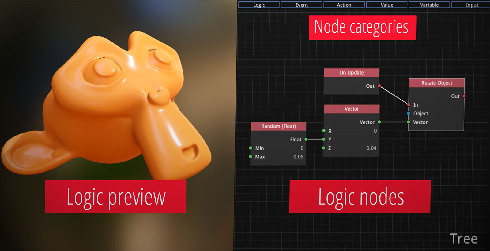

# armorlogic



Node-based logic editor. Used in Armory, written in Haxe and Kha.

## Run

Run [web version](http://armory3d.org/armorlogic) (non-ancient GPU recommended), or build:

[Node](https://nodejs.org) and [Git](https://git-scm.com) required.

1. Recursive clone

```
git clone --recursive https://github.com/armory3d/armorlogic
cd armorlogic
git submodule foreach --recursive git pull origin master
git pull origin master
```

2. Compile HTML5
```
node Kha/make html5
node Kha/make --server
open http://localhost:8080
```

*Note: To edit data files(contained in .blend file), [Armory SDK](http://armory3d.org/download.html) is required. This will be resolved soon.*

## Tech

- [Armory](https://github.com/armory3d/armory)
- [Iron](https://github.com/armory3d/iron)
- [Kha](https://github.com/Kode/Kha)
- [Krom](https://github.com/Kode/Krom)
- [Haxe](https://github.com/HaxeFoundation/haxe)
